## Top 5 products based on product reviews

> <b><i> Load the data required for the scenario by following this [tutorial](https://github.wdf.sap.corp/refapps/datahub-dine/blob/master/tutorials/loading%20of%20data/README.md) </i> </b>

1. open datahub launchpad and click on the modeler.
   
   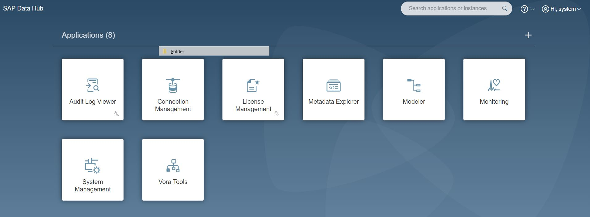
   
2. Now we need to install required python libraries to run our python code. To do that, select the “Repository” tab. Right click on the “Docker Files” menu and select “Create Folder” from the context menu 

   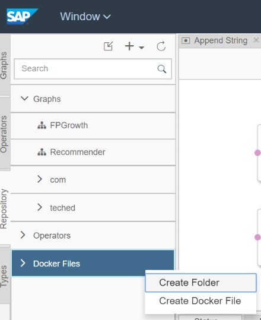
   
3. Provide the folder name as “python library” and click on “OK” button

   
   
4.	Right click on “python library” and select “Create Docker File”.
   
   
   
5. Enter the name as “PythonLibraries” and click on “OK” button.

   
   
6. Copy [this]( ./dockerfile ) code and paste it inside your docker file.
      
      
      
7. Click on the “Show Configuration” button to open the configuration window. Click on the “+” icon adjacent to the “Tags” and add the following tags.

   -	Pandas
   -	Python27

   
   
8. Click on the save button.
   
   
   
9. Click on the “Build” button. Once completed it will show you the build status as completed.

   

10. Create a new graph by clicking on the “+” button.

   

11. Search for the “Read File” operator in the “Operators” section.

   
   
12. Drag and drop “Read File” operator from the left-side pane into the graph editor window.
   
   
   
13. Click on “Open Configuration” button and provide the following properties in the Configuration window.

      - Service: file
      - Path: data/product.csv
      - Only read on change: true

   Let the other properties remains the same.

   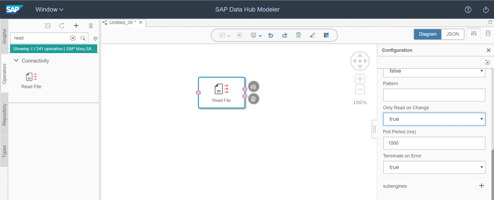
   
14. Drag and drop “Read File” operator from the left-side pane into the graph editor window

   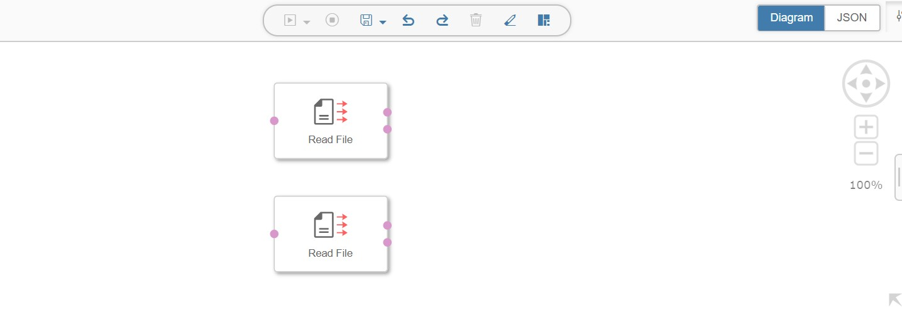

15. Click on “Open Configuration” and provide the following properties in the Configuration window.

      - Service: file
      - Path: data/review.csv
      - Only read on change: true

   Let the other properties remains the same.

   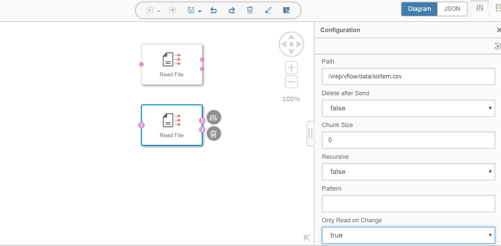

16. Select the “Operators” tab and search for the “Python2Operator”
   
   

17. Drag and drop “Python2Operator” operator from the left-side pane into the graph editor window.

   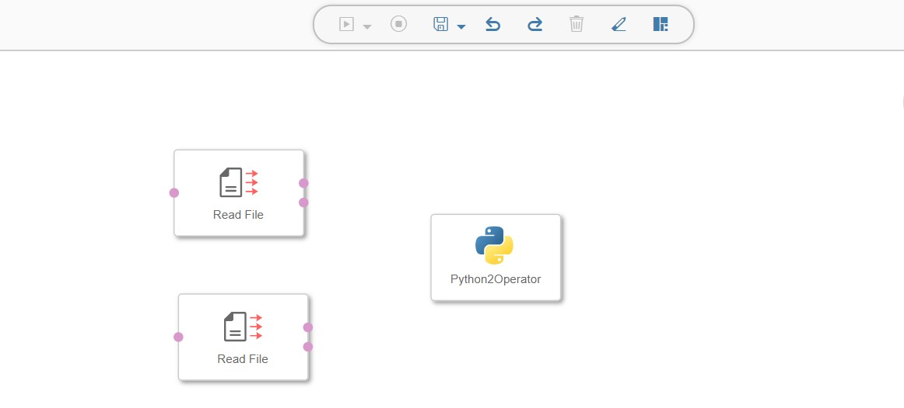
   
18. Now let’s add 2 input ports and 2 output port to the python operator. Select the python operator and click on “add port” button

   
   
19. Enter the values for “Name” and “Type” as shown in the screenshot.

   
   
20. Repeat step no 25 & 26 to add another input port as shown in the screenshot.
   
     
     
21. Similarly add output ports with the details shown in the screen shot

   
   
   
   
22. Join “Read File 1” operator to “input1” port of “python2operator” as shows in the screenshot

   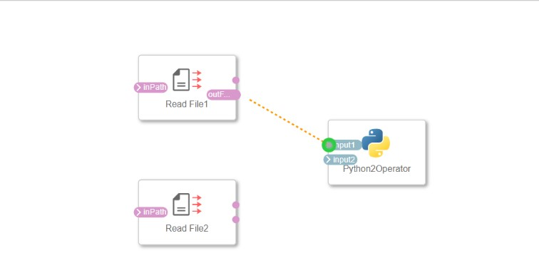

23. Select the ToString Convertor when prompted and then click OK.

   
   
24. Repeat step no 29 & 30 to connect “Read File 2” operator to “input2” port of “python2operator”

   
   
25. Now select the python operator and choose “Open Script” option.

   
   
26. Copy [this](./code%20snippets/ReviewReader.py) code and paste it in the editor.

   
   
27. Now next thing is to tell the graph where we can find the python libraries that we installed. For that right click on “Python2 Operator” and select “Group”.

   
   
28. Select the entire group and click on the “Open Configuration” button.

   

29. Next step is to add tags. Tags describe the runtime requirements of the operator and force the execution in a specific Docker image instance whose Docker file was annotated with the same Tag and Version.

    Click on “+” button to add tags as below.
      -	Pandas
      -	Python27

   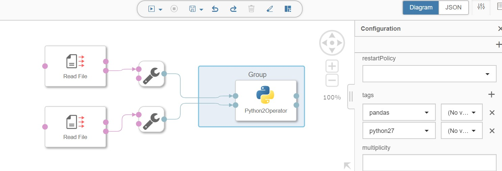
   
30. Next step is to add Text Analysis Connector for text analysis. For that add the java script opearator in the graph. Rename It to “TA Request Creator”.

   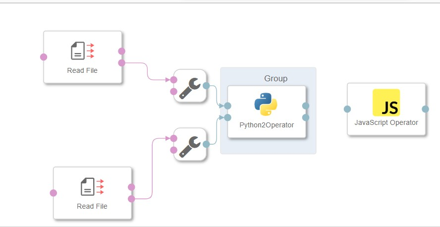

31. Now copy the content from [this file](./code%20snippets/TAcreator.js) and paste it in the script section of JS operator.
   
   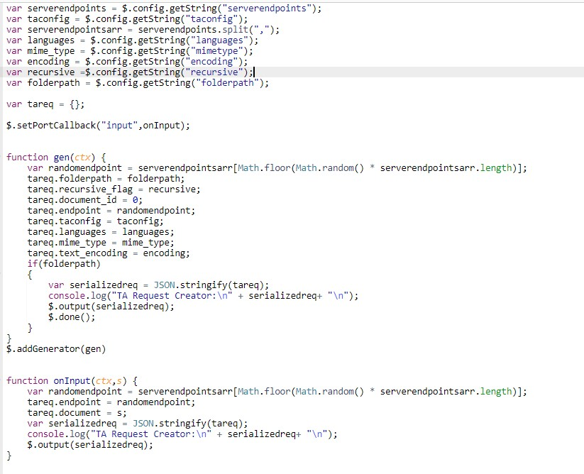

32. Select output1 port of python operator and connect it to input port of java script operator as shown in the graph.
   
   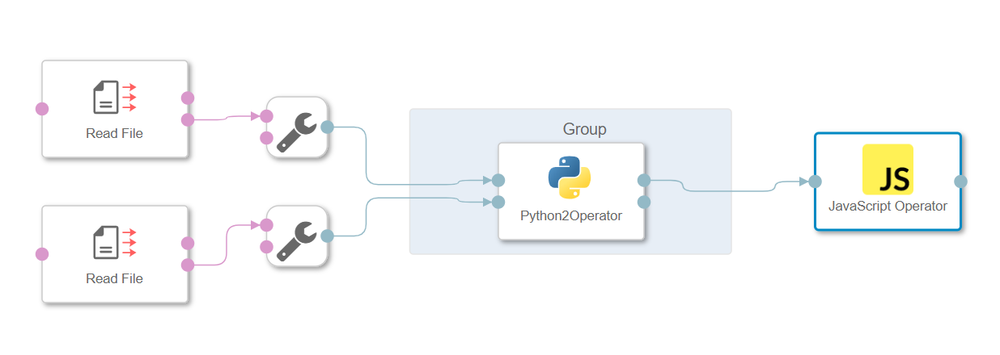

33. Select the JavaScript operator and select “Open Configuration”
   
   
   
34. Select “Add Parameter”.
   
   

35. Add the following properties.

       Taconfig: EXTRACTION_CORE_VOICEOFCUSTOMER
       
       Serverendpoints: vora-textanalysis:10002
      
       Languages: ""
       
       Mimetype: ""
       
       Encoding: ""
       
       Folderpath: ""
       
       Recursive:true 
      
36. Search for the Text analysis connector operator and add it to the graph. Connect java script operator to “text analysis connector”
   
   

37. Add one more "python2operator" in the graph. Add two input ports: input1 and input2 and one output port as output1 to this operator as described in step 25th to 28th.
   
   

38. Join text analysis connector with python operator input one as shown in the screenshot.
   
   
   
39. Join first python2operator’s output port 2 to second python operator’s input port 2.
   
   
   
40. Add code from [this file](./code%20snippets/SentimentIdentifier.py) to the second python2operator's script section.
   
   

41. Add group for this python operator and add tags as described in steps 32 to 36.
   
   

42. Finally add the terminal operator to the graph and connect it with the output1 port of the python operator.

   

43. Save the pipeline and run it.
   
   

44. You can see the result once the pipeline running by clicking on “open UI” option of terminal.
   
   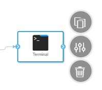

45. You can see top 5 product as pipeline output.
   
   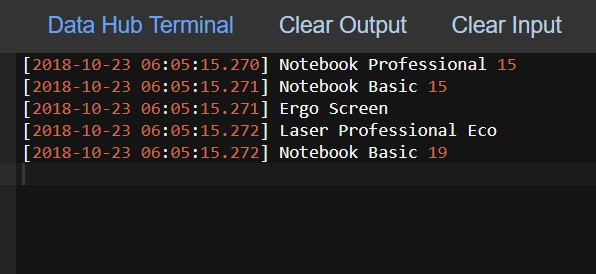

